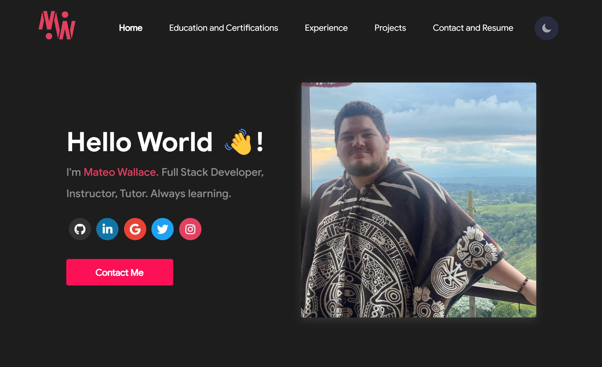

 

<!-- TITLE -->

# React Portfolio - Mateo Wallace

<!-- DESCRIPTION -->

## Description

Web Developer Portfolio built using React. Consists of a home, education, experience, projects, and contact page.

While building this project I learned to:

- Deploy a React App without a back end using [GitHub Pages](https://create-react-app.dev/docs/deployment/#github-pages)
- Use [Iconify](https://iconify.design/) to display various tech related icons

<!-- BUILT WITH -->

### Built With

    

<!-- TABLE OF CONTENTS -->

## Table of Contents

- [Deployed Site](#deployed-site)
- [Deployment Instructions](#deployment-instructions)
- [License](#license)
- [Contact & Contributors](#contact)

<!-- DEPLOYED SITE -->

## Deployed Site

To see the deployed site go to [NEED TO FILL IN]()

(<a href="#readme-top">back to top</a>)

<!-- DEPLOYMENT INSTRUCTIONS -->

## Deployment Instructions

From the command line use:

1. `npm run build`
1. `cd build/`
1. `git init`
1. `git add .`
1. `git commit -m "production build"`
1. `git remote add origin git@github.com:Mateo-Wallace/mateo-wallace.github.io.git`
1. `git remote -v`
1. `git push origin +main`

(<a href="#readme-top">back to top</a>)

<!-- LICENSE -->

## License

Distributed under the MIT License. See [LICENSE](./LICENSE) for more information.

(<a href="#readme-top">back to top</a>)

<!-- CONTACT -->

## Contact

Mateo Wallace - [GitHub](https://github.com/Mateo-Wallace) - [Email](mailto:mateo.t.wallace@gmail.com) - [LinkedIn](https://www.linkedin.com/in/mateo-wallace/)

Project Link: [NEED TO UPDATE](https://github.com/Mateo-Wallace/MP2-Discord-DumBot-V2)

(<a href="#readme-top">back to top</a>)

